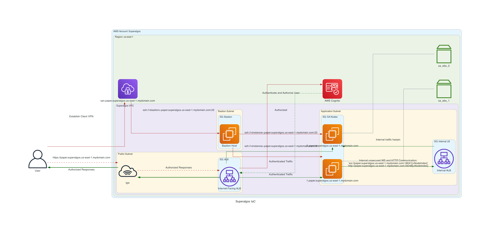

# Superalgos Deployment Scripts for AWS

This project is designed to deploy the Superalgos project securely to aws

It is very much a prototype, not functional, and a work in progress.

## Design

### Authentication

Authentication to [Superalgos](https://superalgos.org/) is handled by the
Internet facing application load balancer and aws cognito.

### Instances

EC2 Nodes have been chosen to host the instance on.

#### Considerations

***EKS + EC2***, ***EKS + Fargate***, ***ECS + EC2***, ***ECS + Fargate*** were
considered for this design:

##### EKS

Both EC2 and Fargate backed EKS

| PROs                | CONs  |
|---------------------|-------| 
| Flexible            | Cost  |
| Easy to manage      |       |
| Extremely Scalable  |       |

##### ECS

Both EC2 and Fargate backed ECS

| PROs | CONs |
|---------------------|------------------------------------| 
| Flexible            | Lack of control                    |
| Easy to manage      | Limited persistent storage options |
| Scalable            | |
| Cost effective      | |

