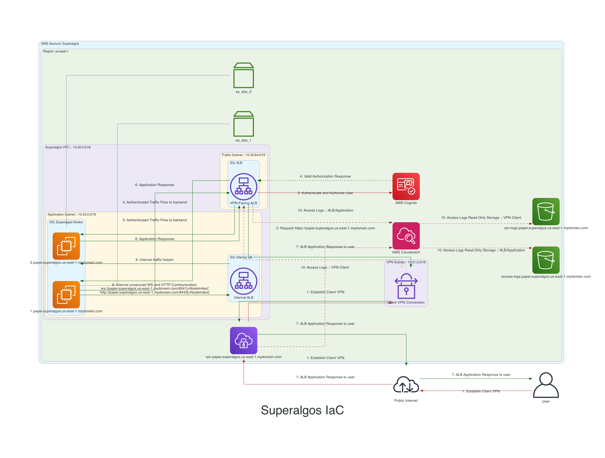

# Superalgos Deployment Scripts for AWS

This project is designed to deploy the Superalgos project securely to aws

It is very much a prototype, not functional, and a work in progress.

## Usage

You, the user, will need to modify the following files for this to be usable.

## tf/environments/global/main.tf
Please change the name of the bucket to a globally unique name

## Project Structure

## Design

### EC2 Node Configuration

Each EC2 node will be configured with a local nginx proxy using TLS certificates,
ensuring all trafic that transits to and from the superalgos application to the
external world will be encrypted.
* Note: This ***assumes*** but **does not ensure** that all traffic to and from the superalgos application will be authenticated and/or authorized

### Authentication and Application Traffic Flow

### Management Traffic Flow

### Authentication

Authentication to [Superalgos](https://superalgos.org/) is handled by the
Internet facing application load balancer and aws cognito.

### Instances

* EC2 Nodes have been chosen to host the instance on.
* EBS Volumes will be attached to each node
  * Storage will be set to persist allowing it to be re-used or inspected
 

#### Considerations

***EKS + EC2***, ***EKS + Fargate***, ***ECS + EC2***, ***ECS + Fargate*** were
considered for this design:

##### EKS

Both EC2 and Fargate backed EKS

| PROs                | CONs  |
|---------------------|-------| 
| Flexible            | Cost  |
| Easy to manage      |       |
| Extremely Scalable  |       |

##### ECS

Both EC2 and Fargate backed ECS

| PROs | CONs |
|---------------------|------------------------------------| 
| Flexible            | Lack of control                    |
| Easy to manage      | Limited persistent storage options |
| Scalable            | |
| Cost effective      | |

### Management Access

* A client vpn will be established to the bastion subnets
* SSH access to the `bastion` host security group will be permitted from the client vpn source address
* Application Security Group will permit SSH access from the Bastion Security Group

