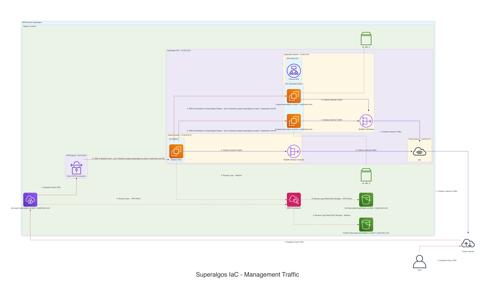

# Superalgos Infrastructure-as-Code

This project is designed to deploy the Superalgos project securely to aws

It is very much a prototype, not functional, and a work in progress.

## Prerequisites
* Forked repository of [superalgos](https://superalgos.org/) per [documentation](https://github.com/Superalgos/Superalgos#superalgos-platform-client-installation)
* An AWS account.
* The ability to delegate a DNS domain for the AWS account to be used.
* AWS API keys for deployment

### Helpful to have
* Some knowledge of terraform
* Some knowledge of AWS infrastructure
* Some knowledge of CI pipelines, specifically Github Actions

## Usage

Start with creating a [private fork](https://docs.github.com/en/repositories/creating-and-managing-repositories/duplicating-a-repository) of this repository. You will need to make several modifications to the terraform files contained, such as defining the appropriate region for deployment and other configuration-specific elements that will be unique for your circumstances. I have tried to make this as easy as possible for you.

### Edit these files

#### Makefile
There are a few key variables that you will want to define for your unique circumstanes

#### scripts/superalgos.setup.sh
You will need update some keys variables in this file to match your unique
circumstances, such as github username.

## Design

### EC2 Node Configuration

Each EC2 node will be configured with a local nginx proxy using TLS certificates,
ensuring all trafic that transits to and from the superalgos application to the
external world will be encrypted.
* Note: This ***assumes*** but **does not ensure** that all traffic to and from the superalgos application will be authenticated and/or authorized

### Authentication and Application Traffic Flow

### Management Traffic Flow

### Authentication

Authentication to [Superalgos](https://superalgos.org/) is handled by the
Internet facing application load balancer and aws cognito.

### Instances

* EC2 Nodes have been chosen to host the instance on.
* EBS Volumes will be attached to each node
  * Storage will be set to persist allowing it to be re-used or inspected
 

#### Considerations

***EKS + EC2***, ***EKS + Fargate***, ***ECS + EC2***, ***ECS + Fargate*** were
considered for this design:

##### EKS

Both EC2 and Fargate backed EKS

| PROs                | CONs  |
|---------------------|-------| 
| Flexible            | Cost  |
| Easy to manage      |       |
| Extremely Scalable  |       |

##### ECS

Both EC2 and Fargate backed ECS

| PROs | CONs |
|---------------------|------------------------------------| 
| Flexible            | Lack of control                    |
| Easy to manage      | Limited persistent storage options |
| Scalable            | |
| Cost effective      | |

### Management Access

* A client vpn will be established to the bastion subnets
* SSH access to the `bastion` host security group will be permitted from the client vpn source address
* Application Security Group will permit SSH access from the Bastion Security Group

